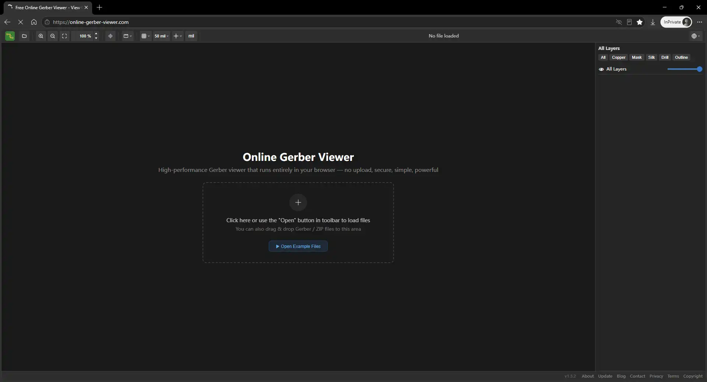
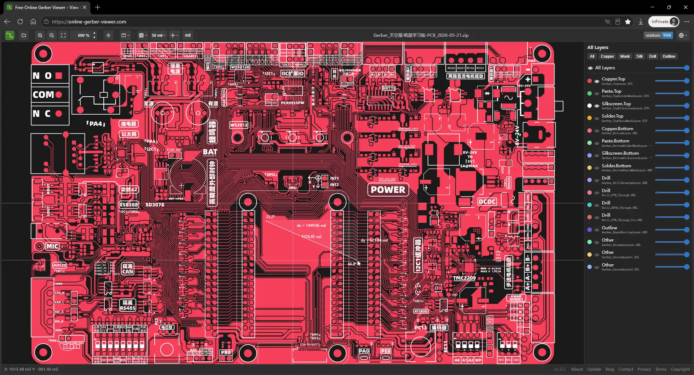

# online-gerber-viewer

online-gerber-viewer.com is a free and easy and powerful online gerber view tool, Secure Gerber viewer with no upload — free, private, browser-only. View Gerber RS-274X and Excellon drill files online. ZIP batch import, multi-layer overlay, drag & drop. All data processed locally, never leaves your machine.

**Online Use**: Visit: [https://online-gerber-viewer.com](https://online-gerber-viewer.com)

## Features

- **Gerber RS-274X** photoplot and **Excellon** drill file support
- **Multi-layer overlay** with independent visibility control and type filtering
- **ZIP batch import** with automatic extraction and file detection
- **Drag-and-drop** files directly onto the canvas
- **Smart layer identification** — auto-detects copper, solder mask, silkscreen, drill, and outline layers
- Supports naming conventions from KiCad, Altium, Eagle, and other EDA tools
- Bilingual UI (Chinese / English, auto-detects browser language)
- Mouse wheel zoom + drag pan
- Runs entirely in the browser — no backend needed

## Layer Colors

| Layer | Color |
|-------|-------|
| Top Copper | Red |
| Bottom Copper | Blue |
| Inner Copper | Auto-assigned multi-color palette |
| Solder Mask | Dark Green |
| Silkscreen | White |
| Drill | Dark Gray |
| Outline | Yellow |

## Supported File Formats

| Extension | Description |
|-----------|-------------|
| `.gbr` `.ger` `.gtl` `.gbl` | Gerber RS-274X |
| `.gts` `.gbs` | Solder mask |
| `.gto` `.gbo` | Silkscreen |
| `.gtp` `.gbp` | Solder paste |
| `.drl` `.xln` `.txt` | Excellon drill files |
| `.zip` | ZIP archives (auto-extracted) |

## Acknowledgments

- [tracespace](https://github.com/tracespace/tracespace) — Gerber parsing engine
- [LeaferJS](https://www.leaferjs.com/) — High-performance Canvas rendering engine

